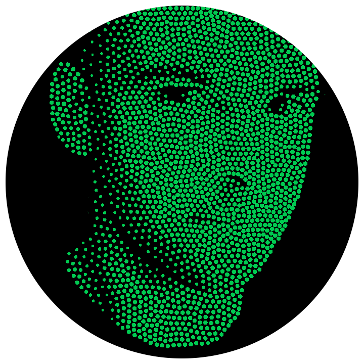

### Marc Doughty

### Expert Skills

  * Windows, Windows Server, macOS, and Linux
  * VMware, Hyper-V, and XenServer (including hosted GPU computing)
  * Storage Spaces and LVM
  * Active Directory and Group Policy
  * SCCM
  * MDT and OSD
  * VDI, RemoteApp, VNC, SSH, and X11
  * PowerShell and BASH scripting
  * CIFS/SMB and NFS
  * Endpoint and Datacenter Hardware
  * Networking technologies and traffic management
  * Network analysis with Wireshark and NMAP
  * Security Architecture and Awareness
  * Planning, naming schemes, building queries, and automation

**Stuff I'm hip to, but not enough to get paid for yet**

  * Python scripting
  * AWS and Azure cloud services
  * Basic database maintenance
  * Getting used to using git for too many things
  * Docker Containers

### Experience
**Senior Endpoint Engineer - Brown University, Providence, RI - (Jan 2008 – Present)**

Planned and implemented centralized Departmental Storage, Home Folders, Folder Redirection, Print Services, and Operating System Deployment (WDS, MDT, and OSD). Architected GPU-enabled RemoteApp platform to replace traditional VDI. Performed top-tier support for 40+ IT Professionals. Wrote various PowerShell scripts to automate systems administration tasks. Packaged and deployed hundreds of software titles (SCCM and standalone). Introduced virtualization and DevOps-style methods to the Endpoint Team. Served on Staff Alliance, Security Rountable, and Emerging Technology committees. Recipient of two Staff Excellence Awards.

**Senior Desktop Support Analyst - Milton Academy, Milton, MA - (Nov 2003 - Jan 2008)**

Provided all levels of support. Reduced number of images (via scripting and extensive sysprep hackery) from 26 to 3. Responsible for hardware specifications purchasing. Acted as liaison between Network, Server, and Desktop teams. Administered file, print, wiki, and streaming media servers. Transitioned school from ‘all-access’ to ‘user-restricted’ desktop environment to improve security and end-user experience.

**Lead Field Technician - Unicom, Woonsocket, RI - (Aug 2002 - Nov 2003)**

Supported executives, marketing team, and remote workers for a major regional bank. Team leader on several mid-sized rollouts (50-500 machines), assisted with Cisco IP Phone rollouts, performed emergency server repair, traveled extensively and led teams of technicians in hardware rollouts. Also worked with customers to master software images, streamline procedures, and diagnose network problems..